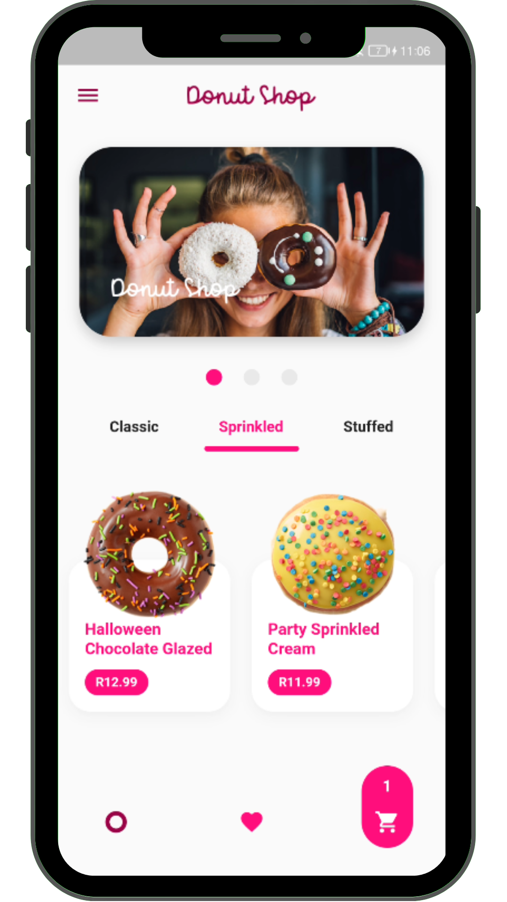
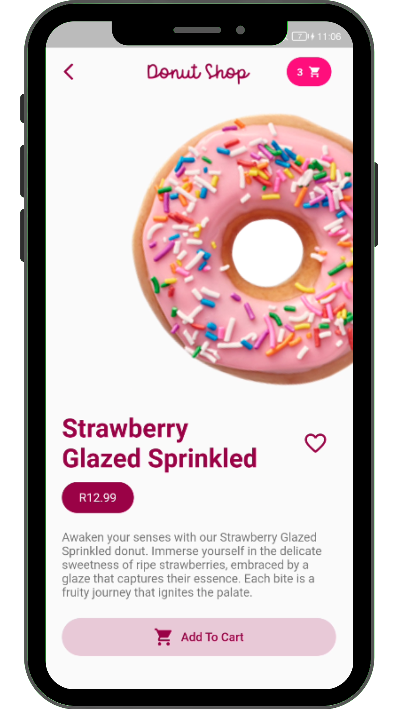
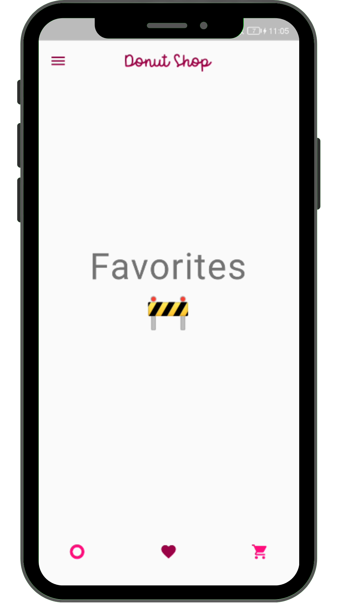
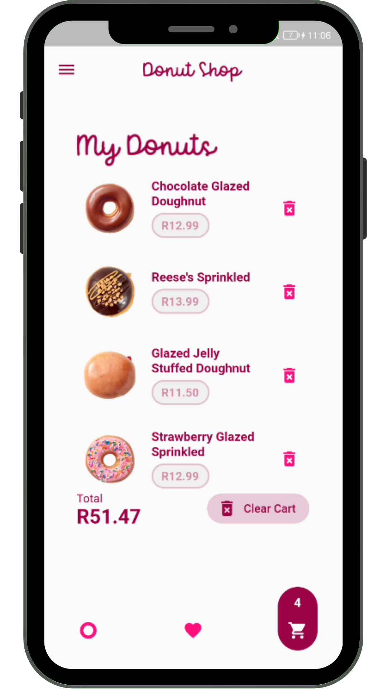

# Romans Donut Shop 🍩
Discover a tempting assortment of donuts, each with its own unique flavor and charm. Dive into the enticing world of glazed, sprinkled, and stuffed creations. Save your favorites, create your dream cart, and satisfy your sweet cravings with a simple tap. Indulgence awaits! 🍩📱

## App in Action
</a>

## Screenshots
Here are some screenshots of the app to give you a sneak peek:

### Main View

### Detail View

### Favorites

### Shopping Cart

## Features

- Browse various types of delicious donuts.
- View detailed information about each donut.
- Add and manage your favorite donuts.
- Convenient shopping cart for easy ordering.

## Technologies Used
- Flutter: The framework used to build the mobile app.
- Dart: The programming language used for developing the app.
- Provider: For State Management. 

## How to Run
1. Clone this repository: `git clone https://github.com/eliascreates/romans-donut-shop`
1. Navigate to the project directory: `cd romans-donut-shop`
1. Install dependencies: `flutter pub get`
1. Run the app: `flutter run`

## Contribution
Feel free to contribute to this project by opening issues or pull requests.

***
## Getting Started
This project is a starting point for a Flutter application.

A few resources to get you started if this is your first Flutter project:

- [Lab: Write your first Flutter app](https://docs.flutter.dev/get-started/codelab)
- [Cookbook: Useful Flutter samples](https://docs.flutter.dev/cookbook)

For help getting started with Flutter development, view the
[online documentation](https://docs.flutter.dev/), which offers tutorials,
samples, guidance on mobile development, and a full API reference.
